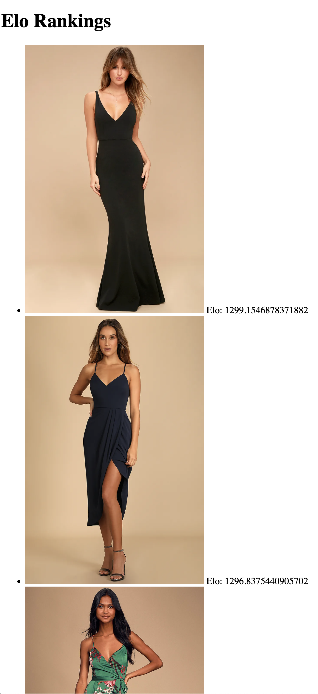

# Fashion Elo
A demo project playing around with javascript, web apps, and backend databases.

A simple web app that displays two images at a time and lets the user vote for a winner. These votes are ranked using an Elo calculation. You can see the rankings on a seperate page. 

The votes and rankings are stored in a SQLite database and managed using python scripts. The frontend uses Flask and html.

# Setup
Create virtual environment and install the required software
```
python3.10 -m venv env3.10
source env3.10/bin/activate
pip install -r requirements.txt
```
Setup the databases:
```
python create_tables.py
```
This creates three tables.
1. `comparison` saves every vote cast
2. `elo_db` saves the elo score for a given image UID
3. `image` maps an image UID to a local filepath

The app needs to know what images to compare and where the files live. Add them to the image database:
```
python add_images.py
```

# Running the app:
```
python run.py
```
Visit http://127.0.0.1:5000/ to see the voting page. You should see a pair of images. Click on one to register your vote.


Run 
```
python calc_elo.py
```
to calculate the rankings. You can see the current ranking here: http://127.0.0.1:5000/elo_rankings


You have to rerun `calc_elo.py` every time you wish to recalculate the rankings.